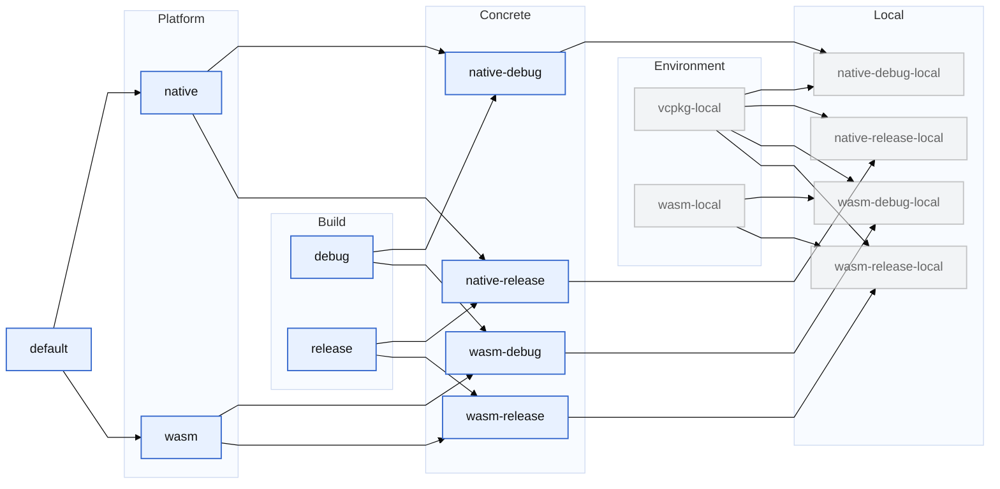

# WebCFD
## Summary

TODO

Package will be renamed from WebCFD to indicate its updated purpose of signal source location/beamforming.

## Build Instructions
1. Produce a `CMakeUserPresets.json` in the repository root to indicate the absolute location of the Emscripten SDK and
`vcpkg` install directory to CMake. An example can be found in
[CMakeUserPresets_SAMPLE.json](https://github.com/oliverdixon/webcfd/blob/master/CMakeUserPresets_SAMPLE.json).

2. Build the project with the native (Dawn) WebGPU backend, or compile with Emscripten to generate the Web Assembly
bundle, using the CMake presets `native-debug-local` and `wasm-debug-local` respectively. Run configurations for
JetBrains IDEs with CMake support are included in `/.idea`.

The intended inheritance hierarchy of CMake profiles looks like the following:

