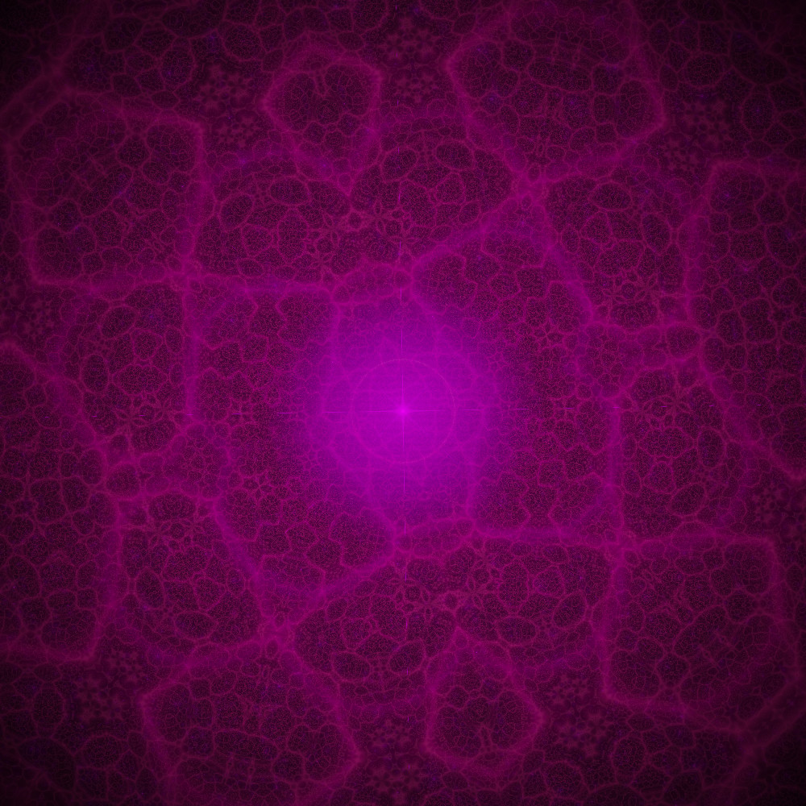
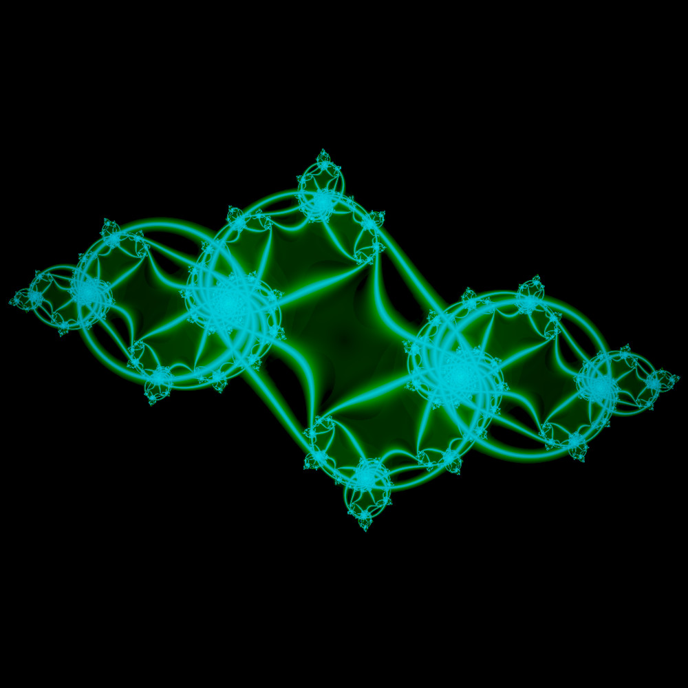
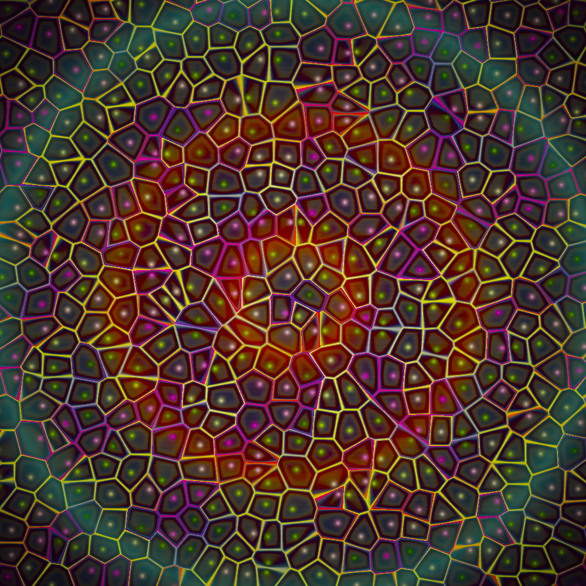
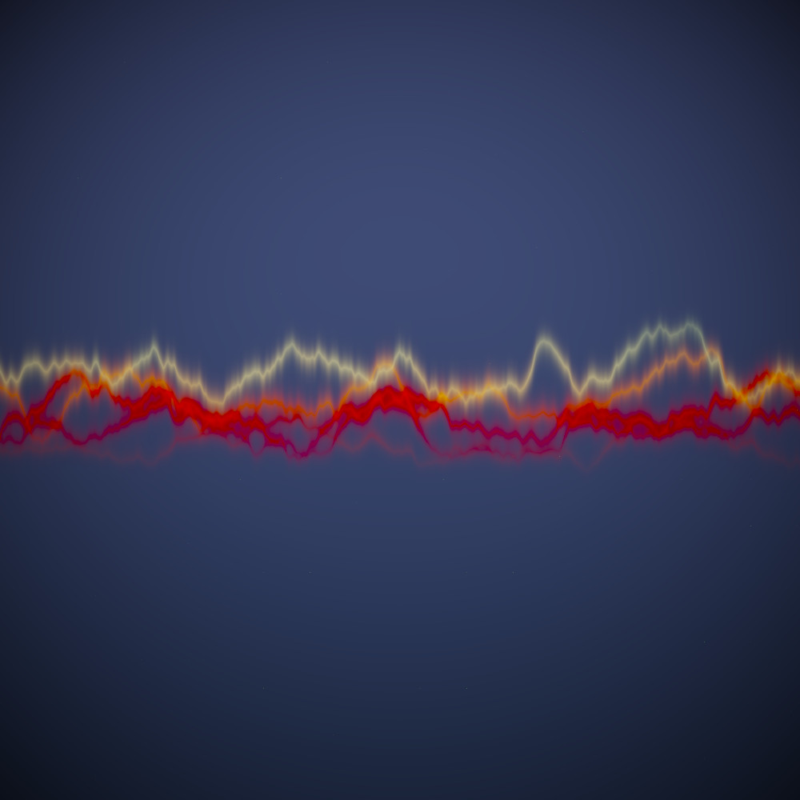

# Web**CFD** (CS Demo Day Version)
## Summary
Web**CFD** (CS Demo Day Version) is a specialised version of Web**CFD** for the University of York Computer Science
2026 early Summer open days. For more information on the Web**CFD** project, please see the
[master](https://github.com/oliverdixon/webcfd/tree/master) branch.

The eagle-eyed reader will note that the shaders contained herein have little relation to Computational Fluid Dynamics
(CFD) or acoustic signal beamforming.

## Screenshots

